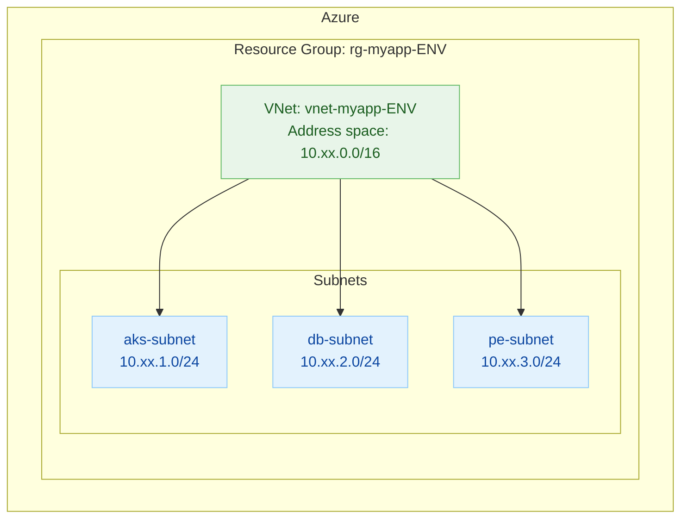

# myapp Azure Terraform scaffolding (envs + remote state)

This repository currently contains multi-environment scaffolding, remote Terraform state, and baseline Azure networking (resource group + VNet + subnets) provisioned via a reusable Terraform module. See TODO.md for the full implementation plan.

Context and decisions
- Cloud: Azure (AKS, MySQL Flexible Server planned)
- Region: northeurope
- Project: myapp
- Domain: myapp.domain.tld (already registered)
- Ingress/TLS preference: Traefik with ACME
- Environments: dev, stg, prod
- Terraform state: stored in external AWS S3 bucket with optional DynamoDB table for state locking

What’s included now
- Environment folders: envs/dev, envs/stg, envs/prod
  - Each environment has:
    - main.tf with: 
      - Terraform core configuration and an S3 backend stub (empty body; configured at init time)
      - AzureRM provider (features {})
    - backend.hcl with placeholders for S3 bucket, key, region, and optional DynamoDB table
- Reusable modules:
  - modules/network: creates Resource Group, VNet, and subnets
  - modules/common: centralizes shared values (project, location, and common tags like owner) used across all envs
  - modules/mysql: creates Azure Database for MySQL Flexible Server (v8). Dev uses smallest SKU (B_Standard_B1ms); stg/prod default to GP_Standard_D2s_v3.
- Updated TODO.md to reflect:
  - Environments decided (dev/stg/prod)
  - Remote state via S3 + DynamoDB (instead of Azure Storage)

Prerequisites for using the current scaffolding
- Terraform CLI 1.6+ or OpenTofu CLI 1.6+
- AWS S3 bucket for storing Terraform state
- (Recommended) DynamoDB table for state locking
  - Table name of your choice; primary key: LockID (String)
- AWS credentials available to the chosen CLI (Terraform/OpenTofu) when initializing (e.g., environment variables, AWS profile)

How remote state works here
- The backend is defined as backend "s3" {} in main.tf for each environment.
- Actual backend values are supplied at init time using the environment-specific backend.hcl files.
- This allows different buckets/keys per environment and avoids hardcoding credentials.

Setup instructions per environment
Example below uses dev; stg/prod are identical with their own backend.hcl.

1) Edit envs/dev/backend.hcl
- Set:
  - bucket = "<your-s3-bucket>"
  - key    = "myapp/dev/terraform.tfstate" (you can keep this default)
  - region = "<s3-bucket-region>" (example: eu-north-1)
  - dynamodb_table = "<your-dynamodb-table>" (optional but recommended)

Set Azure subscription ID:

```console
export ARM_SUBSCRIPTION_ID="add-here-the-subscription-id"
```

2) Initialize in the environment directory
- cd envs/dev
- With Terraform: terraform init -backend-config=backend.hcl
- With OpenTofu: tofu init -backend-config=backend.hcl
- With tf wrapper: tf init -backend-config=backend.hcl

3) Create a plan
- With Terraform: terraform plan
- With OpenTofu: tofu plan
- With tf wrapper: tf plan

4) Apply (optional)
- With Terraform: terraform apply
- With OpenTofu: tofu apply
- With tf wrapper: tf apply

Notes
- Backends cannot use Terraform variables; that’s why we provide backend.hcl files and pass them at init time.
- Although we deploy Azure resources, using S3 for state is fully supported and keeps state external to the Azure subscription.
- Keep backend.hcl values generic and do not commit credentials; authentication to AWS should come from your environment or configured profile.

Managing common variables (owner tag, project, location)
- Shared values are centralized in modules/common.
- To set the owner tag for all environments, edit modules/common/main.tf and change the tags map default (owner = "<your-name-or-team>").
- To override shared values per environment, you can pass variables to the common module in an env’s main.tf, e.g.:
  module "common" {
    source  = "../../modules/common"
    project = "myapp"
    location = "northeurope"
    tags = {
      owner = "team-platform"
    }
  }
- Environments currently consume module.common.project, module.common.location, and module.common.tags when invoking other modules, so changes in modules/common propagate automatically.

Next steps (see TODO.md)
- Add actual Terraform code for networking, AKS, MySQL Flexible Server, and ingress.
- Introduce modules and per-environment variables/outputs as the implementation progresses.
- Add CI/CD to run fmt/validate/plan and to gate prod applies.


## How to use backend.local.hcl files (quick guide)
backend.local.hcl files in each env directory are pre-configured to use the local MinIO S3-compatible service from compose.minio.yaml. Use them when you want to run Terraform without a real AWS S3 bucket.

Use with Makefile:
- Start MinIO: docker compose -f compose.minio.yaml up -d
- Initialize per env with the local backend:
  - make init-local-dev
  - make init-local-stg
  - make init-local-prod
- Then run plan/apply as usual, e.g.: make plan-dev, make apply-dev

Use directly with the CLI:
- cd envs/dev && terraform init -backend-config=backend.local.hcl

Switching between backends:
- If you previously initialized against a different backend, run init with -migrate-state to move state safely:
  - terraform init -migrate-state -backend-config=backend.local.hcl
  - terraform init -migrate-state -backend-config=backend.hcl

Notes:
- Do not commit credentials; backend.local.hcl uses example credentials valid only for the local MinIO container.
- State locking via DynamoDB is not available with MinIO. For teams or locking tests, use real AWS (backend.hcl) or LocalStack with DynamoDB.

## Using a local S3 backend with Docker (MinIO)
You can simulate an S3 backend locally using MinIO. This is useful for development or demos when you don’t want to use a real AWS S3 bucket.

What you’ll get
- A local S3-compatible endpoint at http://localhost:9000
- A MinIO web console at http://localhost:9001
- An S3 bucket named tfstate created automatically (via scripts/minio-create-bucket.sh)

Start MinIO
1) From the repository root, start the stack:
   - docker compose -f compose.minio.yaml up -d
2) Open the console at http://localhost:9001 (user: minioadmin, password: minioadmin123) if you want to browse objects.

Use the local backend.hcl (per environment)
- We’ve added backend.local.hcl in each environment folder configured for MinIO.
- Example for dev:
  - cd envs/dev
  - terraform init -backend-config=backend.local.hcl
  - terraform plan

Notes and limitations
- MinIO does not provide DynamoDB; state locking via DynamoDB is therefore not available. For solo development, this is fine.
- If you need to test state locking locally, consider LocalStack (S3 + DynamoDB). In that case your backend config would include dynamodb_table and point the endpoint to LocalStack. If you want, we can add a ready-made docker-compose for LocalStack as well.
- The S3 backend requires force_path_style = true and several skip_* checks when using MinIO. These are already set in backend.local.hcl.
- The example credentials in backend.local.hcl are for the local MinIO container only. Do not reuse them elsewhere.

Troubleshooting
- If terraform init cannot connect, ensure the MinIO container is running and port 9000 is free.
- If you previously initialized the backend against a different remote, run: terraform init -migrate-state -backend-config=backend.local.hcl
- To reset the local MinIO data, stop the stack and remove the named volume: docker compose -f docker-compose.minio.yml down -v


## Networking diagram (Mermaid)
The current Terraform networking module creates one Resource Group per environment that contains a single Virtual Network with three subnets: aks, db, and pe (for private endpoints). The CIDR blocks differ by environment but follow the same pattern.

- dev: VNet 10.10.0.0/16; subnets 10.10.1.0/24 (aks), 10.10.2.0/24 (db), 10.10.3.0/24 (pe)
- stg: VNet 10.20.0.0/16; subnets 10.20.1.0/24 (aks), 10.20.2.0/24 (db), 10.20.3.0/24 (pe)
- prod: VNet 10.30.0.0/16; subnets 10.30.1.0/24 (aks), 10.30.2.0/24 (db), 10.30.3.0/24 (pe)

MermaidJS chart of the networking topology (generic across environments):



If your viewer doesn’t render Mermaid, the diagram shows:
- Resource Group: rg-myapp-<env>-net
- VNet: vnet-myapp-<env> with address space 10.xx.0.0/16
- Subnets: aks-subnet (10.xx.1.0/24), db-subnet (10.xx.2.0/24), pe-subnet (10.xx.3.0/24)


## Azure Key Vault for MySQL credentials
This repo provisions an Azure Key Vault per environment and makes it the source of truth for the MySQL administrator password. The MySQL Flexible Server reads its administrator_password directly from Key Vault at apply time.

What gets created per environment
- Key Vault: kv-<project>-<env>-<suffix> in the same Resource Group as networking and MySQL
- Access policy: grants the current principal (who runs Terraform) permissions to manage secrets
- Secrets:
  - mysql-admin-username (from a variable; defaults to "mysqladmin")
  - mysql-admin-password (generated by Terraform and stored in Key Vault)

Where it is defined
- Module: modules/keyvault (creates Key Vault and secrets)
- Module: modules/mysql (reads the password from Key Vault)
- Wired in envs/dev|stg|prod/main.tf with keyvault declared before mysql

How the values are sourced
- Username comes from the keyvault module input (or its default) and is written to Key Vault.
- Password is generated inside the keyvault module (random_password) and stored as the secret mysql-admin-password.
- The mysql module reads administrator_password via data.azurerm_key_vault_secret using key_vault_id and the secret name.

Rotation basics
- To rotate the admin password: taint the random_password in modules/keyvault (or bump a rotation trigger), apply to update the secret, then re-apply mysql so it reads the new value.

How to read the secrets (examples)
- Azure CLI (requires you to have access to the vault):
  - az keyvault secret show --vault-name <kv-name> --name mysql-admin-username
  - az keyvault secret show --vault-name <kv-name> --name mysql-admin-password

Notes and considerations
- Purge protection is disabled by default here for easier iteration; enable it in production by passing enable_purge_protection = true in the keyvault module if desired.
- If you prefer RBAC-based authorization for Key Vault data-plane, switch enable_rbac_authorization to true and grant appropriate roles; this example uses classic access policies for simplicity.
- For application access later (AKS workloads), consider integrating with CSI Secret Store Driver to mount or sync Key Vault secrets into Kubernetes.


## Troubleshooting: Key Vault secret read 403 during first apply
If you see an error like:

- Error: making Read request on Azure KeyVault Secret mysql-admin-password: Status=403 Forbidden

It typically means Terraform tried to read the secret before the Key Vault access policy fully propagated. We added an explicit dependency so the MySQL module waits for the Key Vault module to finish. If you still hit a 403 on a very first run (rare propagation lag on Azure side):

- Re-run apply; it should succeed once the policy is active.
- Ensure you are authenticated with the same Azure identity that Terraform uses and that this identity has secret permissions. This repo grants the current principal via an access policy.


## AKS cluster and example nginx app
This repo provisions an Azure Kubernetes Service (AKS) cluster in each environment and provides two ways to deploy a simple myapp (nginx) onto it: via kubectl (plain manifests) or via Helm.

What gets created by Terraform
- AKS: aks-<project>-<env> using Managed Identity, Azure CNI on the aks subnet, Standard_B2s VM size, 1 node.
- Kubernetes provider configuration (Terraform) that connects to the created cluster.
- Note: In stg/prod, example nginx resources may already be managed by Terraform. To avoid double-management, prefer one path (Terraform OR kubectl/Helm) per environment.

Option A: Deploy myapp with kubectl (plain manifests)
1) Ensure AKS exists (terraform apply) and fetch credentials:
   - make aks-credentials-dev
2) Apply manifests:
   - make kubectl-apply-dev
3) Verify:
   - kubectl get deploy,svc -n myapp
   - kubectl get pods -n myapp

The manifests live under k8s/myapp and create:
- Namespace: myapp
- Deployment: nginx (image nginx:stable), replicas=2
- Service: ClusterIP port 80


## Traefik ingress (Helm) exposing azure-terraform.ineen.net
This section explains how to install Traefik via Helm on AKS and expose the myapp (nginx) service at https://azure-terraform.ineen.net using ACME (Let’s Encrypt).

Prereqs
- AKS is provisioned and you can authenticate: make aks-credentials-dev (or -stg, -prod)
- You have deployed the example app manifests: make kubectl-apply-dev (this creates Service nginx in namespace myapp)

1) Set your ACME email
- Edit helm/traefik/values.yaml and change admin@example.com to a valid email you control.

2) Install Traefik via Helm
- make helm-install-traefik-dev
- This creates namespace traefik, installs chart traefik/traefik with a Service of type LoadBalancer (ports 80/443).

3) Get the Traefik public IP
- kubectl get svc -n traefik
- Note the EXTERNAL-IP of the traefik Service.

4) Create a DNS record
- Create an A record for azure-terraform.ineen.net pointing to the EXTERNAL-IP from step 3.
- Wait for DNS to propagate (can be a few minutes). Verify with: dig +short azure-terraform.ineen.net

5) Apply the Ingress
- make kubectl-apply-dev
- This applies k8s/myapp/ingress.yaml which routes host azure-terraform.ineen.net to Service nginx:80 via Traefik (ingressClassName: traefik) and requests a TLS certificate (resolver: le).

6) Verify HTTPS
- Watch Traefik events: kubectl -n traefik logs deploy/traefik -f
- Once ACME challenge is solved, Test: curl -I https://azure-terraform.ineen.net
- You should see HTTP/2 200 and a valid Let’s Encrypt certificate.

Notes
- To uninstall Traefik: make helm-uninstall-traefik-dev
- For a static public IP, pre-create an Azure Public IP and set service.loadBalancerIP in helm/traefik/values.yaml before installing.
